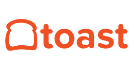

<!-- .slide: class="bigslide" -->

#### _Welcome To_

# BostonJS

[<em>@</em>bos_js](https://twitter.com/bos_js)  &nbsp; ~ &nbsp; [<em>#</em>bostonjs](https://twitter.com/search?q=%23bostonjs&src=typd)

---

#### _we have a_

# Code of Conduct

[jsconf.com/codeofconduct.html](http://jsconf.com/codeofconduct.html)
<small>

Inappropriate behavior will **not** be tolerated.

If you are made to feel unsafe or unwelcome,

find an organizer or contact us by DM in slack.

</small>

---

#### _we have a_

# Slack Community

[bostonjavascript.slack.com](https://bostonjavascript.slack.com/)

---

#### _Tonight's Meetup_
#### _Generously Sponsored by_

---

## Understanding the V8 Runtime

### _to Maximize Application Performance_

_with_

## Dan Fields

<small>([<em>@</em>danielsfields](https://twitter.com/danielsfields))</small>

---

### Start drinking your

## Coffee(Script) decaf!

_with_

## Eubene Sa 

<small>([<em>@</em>EubeneSa](https://twitter.com/EubeneSa))</small>
